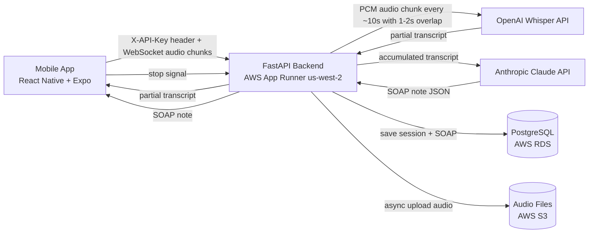
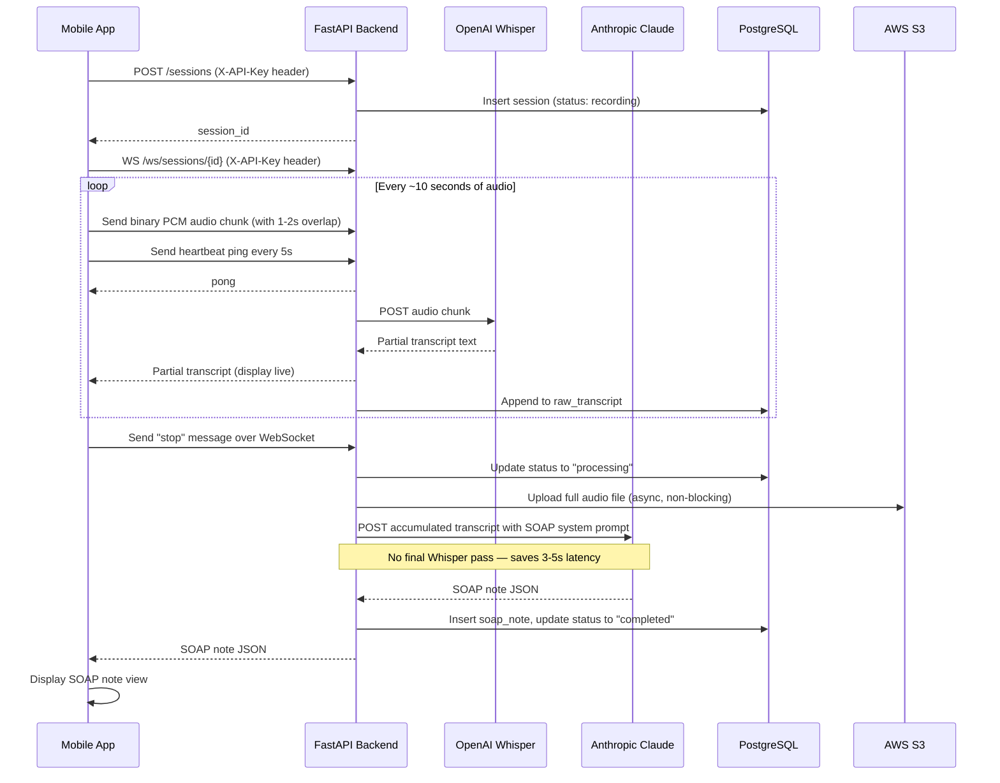

# VetScribe AI — High-Level Design (HLD)

---

## Requirements

### Functional Requirements

| # | Requirement | Priority | Notes |
|---|-------------|----------|-------|
| F1 | Vet can press Record immediately with no required input | Must Have | Session auto-named by timestamp |
| F2 | Live transcript displayed on screen as audio is captured | Must Have | ~10s lag acceptable for MVP |
| F3 | Vet can pause and resume recording during a session | Must Have | Paused audio excluded from transcript |
| F4 | Stop confirmation dialog before ending session | Must Have | Prevents accidental data loss |
| F5 | AI generates a structured SOAP note after recording stops | Must Have | S / O / A / P sections |
| F6 | Vet can view SOAP note and raw transcript in tabbed view | Must Have | Toggle between tabs |
| F7 | Session saved and accessible in history drawer | Must Have | Sorted by most recent |
| F8 | Vet can rename a session via long press context menu | Must Have | Default name is auto timestamp |
| F9 | Vet can delete a session via long press context menu | Must Have | |
| F10 | Error state with Retry + View Transcript fallback if SOAP fails | Must Have | Raw transcript always preserved |
| F11 | Support for Mandarin/English code-switching (Chinglish) | Must Have | Critical for Taiwan market |
| F12 | Empty state in drawer for first-time use | Should Have | Onboarding message |
| F13 | Export SOAP note as PDF | Out of Scope | Post-MVP |
| F14 | Integration with vet desktop software | Out of Scope | Post-MVP |
| F15 | Patient profiles (species, breed, DOB, weight) | Out of Scope | Post-MVP |
| F16 | Multi-user / clinic accounts | Out of Scope | Post-MVP |

### Non-Functional Requirements

| # | Requirement | Target |
|---|-------------|--------|
| N1 | SOAP note generated within 10 seconds of stopping recording | Latency |
| N2 | Live transcript lag under 10 seconds | Latency |
| N3 | Raw audio and records stored securely in AWS | Security |
| N4 | App runs on iOS for MVP | Platform |
| N5 | System handles 1 concurrent user for MVP | Scale |
| N6 | Backend stateless — session state persisted in DB, not memory | Reliability |
| N7 | All API endpoints protected by API key header | Security |
| N8 | WebSocket connection maintained via heartbeat ping/pong every 5s | Reliability |

### External Dependencies

| Service | Purpose | Required for MVP |
|---------|---------|-----------------|
| OpenAI API | Whisper STT transcription | Yes |
| Anthropic API | Claude SOAP note generation | Yes |
| AWS Account | App Runner, RDS, S3 | Yes |

---

## Confirmed Tech Stack

| Layer | Choice | Reason |
|-------|--------|--------|
| Mobile | React Native + Expo | Cross-platform, fast to prototype, large ecosystem |
| Backend | Python FastAPI | Async, native WebSocket support, fast to build |
| Hosting | AWS App Runner (`us-west-2`) | Managed, no infra ops, supports persistent WebSockets. Oregon region for Seattle testing — switch to `ap-northeast-1` (Tokyo) for Taiwan production |
| STT | OpenAI Whisper API | Best code-switching (Chinglish) quality of any available API |
| LLM | Anthropic Claude (claude-sonnet-4-6) | Best structured output, strong medical reasoning |
| Database | PostgreSQL on AWS RDS | Reliable, structured, explicit SOAP columns for MVP |
| Audio Storage | AWS S3 | Standard, cheap, durable |

---

## System Overview

---

## Data Flow (Real-Time)

---

## Build Phases

```mermaid
graph TD
    P0[Phase 0 — Prompt Engineering]
    P0 --> P0A[Draft Claude SOAP system prompt]
    P0 --> P0B[Write 3-5 synthetic Chinglish transcripts]
    P0 --> P0C[Test prompt in Claude Playground - validate JSON output]

    P1[Phase 1 — Backend Core]
    P1 --> P1A[FastAPI project setup + Dockerfile]
    P1 --> P1B[PostgreSQL schema + SQLAlchemy models]
    P1 --> P1C[X-API-Key auth middleware]
    P1 --> P1D[Whisper integration - PCM chunks with overlap]
    P1 --> P1E[Claude integration - SOAP prompt from Phase 0]
    P1 --> P1F[REST API endpoints]
    P1 --> P1G[WebSocket endpoint + heartbeat + audio pipeline]

    P2[Phase 2 — Mobile App]
    P2 --> P2A[Expo project setup]
    P2 --> P2B[Home screen + Record button]
    P2 --> P2C[PCM audio recording + WebSocket streaming]
    P2 --> P2D[Heartbeat ping/pong + reconnection logic]
    P2 --> P2E[Live transcript display + pulsing indicator]
    P2 --> P2F[Stop confirmation dialog]
    P2 --> P2G[SOAP note view + transcript tab]
    P2 --> P2H[Slide-in drawer with session history]
    P2 --> P2I[Long press context menu - rename and delete]

    P3[Phase 3 — Infrastructure with AWS CDK]
    P3 --> P3A[CDK project setup in infra/ directory - TypeScript]
    P3 --> P3B[CDK stack - AWS RDS PostgreSQL]
    P3 --> P3C[CDK stack - AWS S3 audio storage]
    P3 --> P3D[CDK stack - AWS App Runner - FastAPI container]
    P3 --> P3E[CDK stack - VPC + security groups]
    P3 --> P3F[Environment secrets via AWS Secrets Manager]
    P3 --> P3G[cdk deploy to us-west-2 for testing]
    P3 --> P3H[Switch region to ap-northeast-1 Tokyo for Taiwan production]

    P0 --> P1 --> P2 --> P3
```

---

## Finding Test Data

For Mandarin/English veterinary SOAP notes to build and test the Claude prompt:

- **VetCompass** (vetcompass.org) — large UK veterinary clinical dataset, English SOAP notes, good for understanding structure and tone
- **NCBI PubMed** — search `"veterinary" "SOAP note"` for published examples
- **Kaggle** — search `"veterinary medical records"`
- **Mandarin-specific** — no good public datasets exist. Recommended approach:
  - Write 5–10 synthetic mock transcripts in the style of a Taiwan vet clinic (mix of Traditional Chinese and English medical terms)
  - Use these as few-shot examples in the Claude system prompt
  - This will significantly improve SOAP output quality for code-switched input

---

## Open Questions

- [ ] **iOS only or Android too for MVP?**
- [ ] **Do you have your Anthropic and OpenAI API keys ready?**
- [ ] **Claude SOAP prompt**: Should we draft and test the prompt before writing backend code? (Recommended — see Phase 0)
