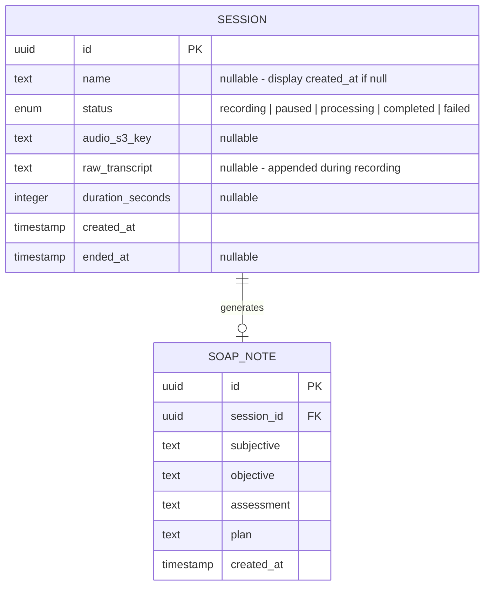

# VetScribe AI — Low-Level Design (LLD)

---

## Authentication

All endpoints (REST and WebSocket) require an `X-API-Key` header. The key is a static secret stored as an environment variable on the backend.

```
X-API-Key: <your-secret-key>
```

This prevents open access to LLM endpoints which would create billing risk. For MVP (single user), a single static key is sufficient. Multi-user auth (e.g. Firebase, JWT) is post-MVP.

---

## WebSocket Reliability

Two issues must be handled for stable WebSocket connections:

1. **Heartbeat** — App sends a `ping` message every 5 seconds. Backend responds with `pong`. If no pong received within 10 seconds, app treats connection as dropped.

2. **Reconnection** — If the WebSocket drops (e.g. switching from Wi-Fi to 5G), the mobile app must:
   - Detect the disconnection
   - Re-open the WebSocket to `/ws/sessions/{id}` using the same `session_id`
   - Resume sending audio chunks from where it left off
   - Backend resumes appending to the existing session in DB

---

## Whisper Chunking Strategy

Whisper is a **batch API** — it does not support true audio streaming. To achieve live transcript display, we use a chunked approach:

1. Mobile records audio continuously using `expo-av` in **PCM/WAV format** (uncompressed, easy to chunk and stitch)
2. Every **10 seconds**, mobile sends the buffered audio chunk as binary over WebSocket
3. Each chunk includes a **1-2 second overlap** with the previous chunk to prevent words being clipped at seam boundaries
4. Backend sends the chunk directly to Whisper API
5. Whisper returns a transcript for that chunk (overlap region is deduplicated before appending)
6. Backend appends and returns the cumulative transcript to mobile
7. On Stop, the **accumulated partial transcript** is sent directly to Claude for SOAP generation — no final Whisper pass needed, saving 3-5 seconds of latency

**Why overlap instead of VAD (Voice Activity Detection):** VAD would be more accurate but adds a dependency and implementation complexity. 1-2 second overlap is simpler, good enough for MVP, and can be upgraded to VAD later.

**Why PCM/WAV instead of M4A:** M4A/AAC chunks are fragile — chunks 2+ lack the file header that Whisper requires. PCM is uncompressed raw audio that can be cleanly chunked without header issues. The tradeoff is larger file size, which is acceptable for MVP.

**Trade-off:** ~10 second lag on live display. This is acceptable for MVP — the vet doesn't need word-by-word real-time feedback, just confirmation the session is being captured.

---

## Claude SOAP Prompt Design

The Claude system prompt must include a **medical translation layer** to handle Chinglish input from Whisper. Whisper may output phonetic English for medical abbreviations (e.g. "see bee see" instead of "CBC").

System prompt structure:
1. Role: "You are a veterinary clinical scribe specializing in Taiwan vet clinics"
2. Input context: "The transcript may be a mix of Traditional Chinese and English medical terms"
3. Medical translation layer: Map common phonetic outputs to correct abbreviations (CBC, X-Ray, CT, etc.)
4. Output format: Strict JSON with keys `subjective`, `objective`, `assessment`, `plan`
5. Few-shot examples: 2-3 synthetic Chinglish transcripts with expected SOAP output

> **Note:** The Claude prompt should be drafted and tested with synthetic Chinglish examples **before** writing backend code. This de-risks the core AI output quality early.

---

## Database Schema



> No User table for MVP — single user, static API key auth.
>
> **Future consideration:** `subjective`, `objective`, `assessment`, `plan` columns could be migrated to a single `JSONB` column to support flexible sub-sections per animal type (e.g. exotic vs small animal). Adding new columns to PostgreSQL is a simple one-liner migration and not a burden for MVP.

---

## API Design

### REST Endpoints

All endpoints require `X-API-Key` header.

| Method | Endpoint | Description |
|--------|----------|-------------|
| `POST` | `/sessions` | Create a new session, returns `session_id` |
| `GET` | `/sessions` | List all sessions (for drawer history) |
| `GET` | `/sessions/{id}` | Get session detail including SOAP note |
| `PATCH` | `/sessions/{id}` | Rename session |
| `DELETE` | `/sessions/{id}` | Delete session and associated audio from S3 |
| `POST` | `/sessions/{id}/retry-soap` | Retry SOAP generation from saved transcript |

### WebSocket

| Endpoint | Description |
|----------|-------------|
| `WS /ws/sessions/{id}` | Bidirectional: receive binary PCM audio chunks, send transcript + SOAP note back |

### WebSocket Message Protocol

**Client → Server:**
```json
// Control messages (JSON)
{ "type": "stop" }
{ "type": "pause" }
{ "type": "resume" }
{ "type": "ping" }

// Audio data (binary, raw PCM chunks)
```

**Server → Client:**
```json
{ "type": "pong" }
{ "type": "transcript", "text": "The cat has been showing anorexia..." }
{ "type": "soap", "data": { "subjective": "...", "objective": "...", "assessment": "...", "plan": "..." } }
{ "type": "error", "message": "SOAP generation failed. Transcript saved." }
```

---

## Project Structure

```
vet-scribe/
├── backend/
│   ├── app/
│   │   ├── main.py                  # FastAPI app entry point
│   │   ├── middleware/
│   │   │   └── auth.py              # X-API-Key validation middleware
│   │   ├── routers/
│   │   │   ├── sessions.py          # REST endpoints
│   │   │   └── websocket.py         # WebSocket endpoint + audio pipeline
│   │   ├── services/
│   │   │   ├── transcription.py     # Whisper API wrapper + chunk overlap logic
│   │   │   └── soap_generator.py    # Claude API wrapper + system prompt
│   │   ├── models/
│   │   │   └── session.py           # SQLAlchemy models
│   │   └── db/
│   │       └── database.py          # DB connection + session factory
│   ├── requirements.txt
│   └── Dockerfile
│
├── mobile/
│   ├── app/
│   │   ├── index.tsx                # Home screen (Record button)
│   │   ├── session/
│   │   │   └── [id].tsx             # SOAP note + transcript view
│   │   └── _layout.tsx              # Drawer layout wrapper
│   ├── components/
│   │   ├── Drawer.tsx               # Slide-in history drawer
│   │   ├── RecordButton.tsx         # Big record button
│   │   ├── PulsingIndicator.tsx     # Pulsing animation during recording
│   │   └── SOAPNoteView.tsx         # Tabbed SOAP + transcript display
│   ├── services/
│   │   ├── api.ts                   # REST API calls (with X-API-Key header)
│   │   ├── websocket.ts             # WebSocket + heartbeat + reconnection logic
│   │   └── audio.ts                 # expo-av PCM recording wrapper
│   └── package.json
│
├── infra/
│   ├── bin/
│   │   └── app.ts                   # CDK app entry point
│   ├── lib/
│   │   └── vet-scribe-stack.ts      # Main CDK stack (RDS, S3, App Runner, VPC)
│   ├── cdk.json
│   ├── tsconfig.json
│   └── package.json
│
└── docs/
    ├── hld.md
    ├── lld.md
    ├── wireframes.md
    └── user-stories.md
```
