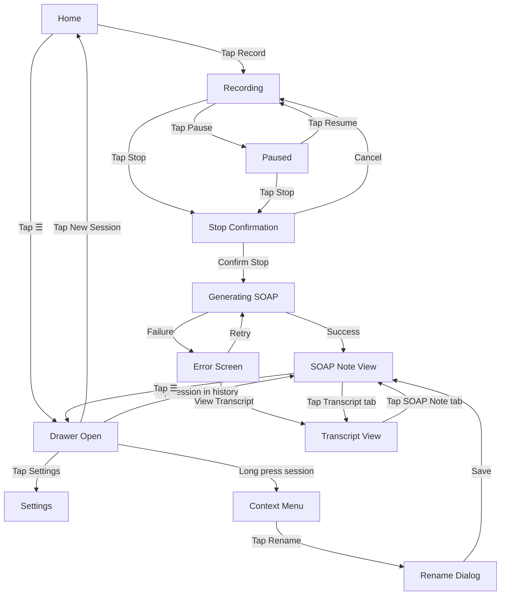

# VetScribe AI — Wireframes (MVP)

---

## Screen 1: Home

```
┌─────────────────────────────┐
│ ☰        VetScribe          │
│                             │
│                             │
│                             │
│                             │
│        ╔═══════════╗        │
│        ║           ║        │
│        ║  🎙  REC  ║        │
│        ║           ║        │
│        ╚═══════════╝        │
│                             │
│    Tap to start recording   │
│                             │
│                             │
│                             │
│                             │
│                             │
│                             │
└─────────────────────────────┘
```

---

## Screen 1B: Drawer Open (with sessions)

```
┌──────────────┬──────────────┐
│ ☰  Menu      │              │
│ ──────────── │              │
│ + New Session│  (dimmed)    │
│              │              │
│ History      │              │
│ ──────────── │              │
│ Mr. Lee      │              │
│ Mar 26 2:30p │              │
│              │              │
│ Mrs. Chen    │              │
│ Mar 25 4:15p │              │
│              │              │
│ Session...   │              │
│ Mar 25 9:00a │              │
│              │              │
│ ⚙ Settings   │              │
└──────────────┴──────────────┘
```

> Tapping anywhere on the dimmed right side closes the drawer.

---

## Screen 1C: Drawer Open (empty state)

```
┌──────────────┬──────────────┐
│ ☰  Menu      │              │
│ ──────────── │              │
│ + New Session│  (dimmed)    │
│              │              │
│ History      │              │
│ ──────────── │              │
│              │              │
│ No sessions  │              │
│ yet. Tap New │              │
│ Session to   │              │
│ get started. │              │
│              │              │
│              │              │
│              │              │
│ ⚙ Settings   │              │
└──────────────┴──────────────┘
```

---

## Screen 2: Recording in Progress

```
┌─────────────────────────────┐
│ ☰        VetScribe          │
│                             │
│       ● REC  00:04:23       │
│       (pulsing red dot)     │
│                             │
│ ─────────────────────────── │
│  Live Transcript            │
│ ─────────────────────────── │
│                             │
│  "The cat has been showing  │
│   anorexia and dyspnea...   │
│   我們先做個 CBC 還有        │
│   chest X-ray 好嗎..."      │
│                             │
│                             │
│                             │
├─────────────────────────────┤
│   [  ⏸ Pause  ]  [ ⏹ Stop ]  │
└─────────────────────────────┘
```

---

## Screen 2B: Stop Confirmation Dialog

```
┌─────────────────────────────┐
│ ☰        VetScribe          │
│                             │
│       ● REC  00:04:23       │
│                             │
│  ┌───────────────────────┐  │
│  │   End Recording?      │  │
│  │                       │  │
│  │  This will stop the   │  │
│  │  session and generate │  │
│  │  the SOAP note.       │  │
│  │                       │  │
│  │  [Cancel]  [Stop]     │  │
│  └───────────────────────┘  │
│                             │
│   (background dimmed)       │
│                             │
├─────────────────────────────┤
│   [  ⏸ Pause  ]  [ ⏹ Stop ]  │
└─────────────────────────────┘
```

---

## Screen 3: Recording Paused

```
┌─────────────────────────────┐
│ ☰        VetScribe          │
│                             │
│       ⏸ PAUSED  00:04:23    │
│                             │
│ ─────────────────────────── │
│  Live Transcript            │
│ ─────────────────────────── │
│                             │
│  "The cat has been showing  │
│   anorexia and dyspnea...   │
│   我們先做個 CBC 還有        │
│   chest X-ray 好嗎..."      │
│                             │
│                             │
│                             │
├─────────────────────────────┤
│   [ ▶ Resume ]  [ ⏹ Stop ]  │
└─────────────────────────────┘
```

---

## Screen 4: Generating SOAP Note (Loading)

```
┌─────────────────────────────┐
│ ☰        VetScribe          │
│                             │
│                             │
│                             │
│                             │
│         ⏳                  │
│   Generating SOAP note...   │
│                             │
│                             │
│                             │
│                             │
│                             │
│                             │
│                             │
│                             │
│                             │
└─────────────────────────────┘
```

---

## Screen 4B: SOAP Generation Failed

```
┌─────────────────────────────┐
│ ☰        VetScribe          │
│                             │
│                             │
│         ⚠️                  │
│   Failed to generate        │
│   SOAP note.                │
│                             │
│   Your transcript has       │
│   been saved.               │
│                             │
│   [ 🔄 Retry ]              │
│                             │
│   [ View Transcript ]       │
│                             │
│                             │
│                             │
└─────────────────────────────┘
```

---

## Screen 5: SOAP Note + Transcript View

```
┌─────────────────────────────┐
│ ☰  Mar 26, 2:30 PM      ✏️  │
├─────────────────────────────┤
│  [ SOAP Note ] [ Transcript]│
├─────────────────────────────┤
│                             │
│  S — Subjective             │
│  ─────────────────────────  │
│  Owner reports cat has      │
│  shown anorexia and         │
│  dyspnea for 2 days...      │
│                             │
│  O — Objective              │
│  ─────────────────────────  │
│  CBC and chest X-ray        │
│  ordered. Resp rate         │
│  elevated at 48 bpm...      │
│                             │
│  A — Assessment             │
│  ─────────────────────────  │
│  Suspected pleural          │
│  effusion. R/O heart        │
│  disease...                 │
│                             │
│  P — Plan                   │
│  ─────────────────────────  │
│  1. CBC stat                │
│  2. Chest X-ray             │
│  3. Recheck in 48hrs        │
│                             │
└─────────────────────────────┘
```

> Tapping **☰** opens the drawer.
> Tapping **✏️** opens the rename dialog.

---

## Screen 6: Raw Transcript View

```
┌─────────────────────────────┐
│ ☰  Mar 26, 2:30 PM      ✏️  │
├─────────────────────────────┤
│  [ SOAP Note ] [ Transcript]│
├─────────────────────────────┤
│                             │
│  Raw Transcript             │
│  ─────────────────────────  │
│                             │
│  "The cat has been showing  │
│   anorexia and dyspnea      │
│   for about two days.       │
│                             │
│   我們先做個 CBC 還有        │
│   chest X-ray 好嗎?         │
│                             │
│   Owner: 好，那要住院嗎?    │
│                             │
│   Vet: 先看看結果再說，      │
│   if the effusion is        │
│   significant we may        │
│   need to drain it..."      │
│                             │
│                             │
└─────────────────────────────┘
```

---

## Screen 8: Session Long Press (Context Menu)

```
┌──────────────┬──────────────┐
│ ☰  Menu      │              │
│ ──────────── │              │
│ + New Session│  (dimmed)    │
│              │              │
│ History      │              │
│ ──────────── │              │
│ ┌──────────┐ │              │
│ │ Mr. Lee  │ │              │
│ │Mar 26 2:30p              │
│ ├──────────┤ │              │
│ │ ✏️ Rename │ │              │
│ │ 🗑 Delete │ │              │
│ └──────────┘ │              │
│              │              │
│ ⚙ Settings   │              │
└──────────────┴──────────────┘
```

> Long pressing a session in the drawer shows a context menu with Rename and Delete options.

---

## Screen 8B: Rename Input Dialog

```
┌──────────────┬──────────────┐
│ ☰  Menu      │              │
│ ──────────── │              │
│ + New Session│  (dimmed)    │
│              │              │
│  ┌─────────────────────┐    │
│  │  Rename Session     │    │
│  │                     │    │
│  │  ┌───────────────┐  │    │
│  │  │ Mr. Lee       │  │    │
│  │  └───────────────┘  │    │
│  │                     │    │
│  │  [Cancel]  [Save]   │    │
│  └─────────────────────┘    │
│              │              │
│ ⚙ Settings   │              │
└──────────────┴──────────────┘
```

---

## Screen Flow


